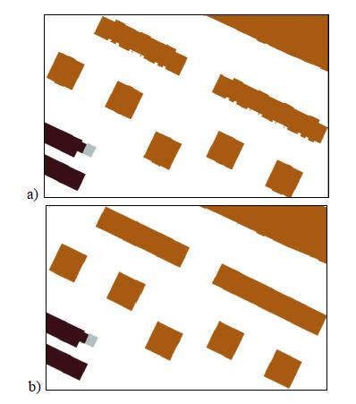
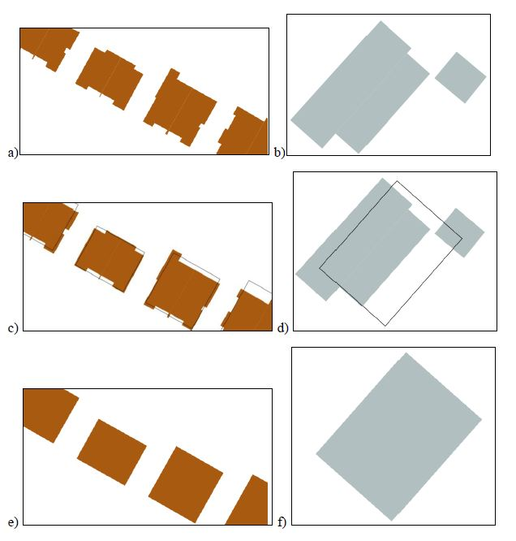
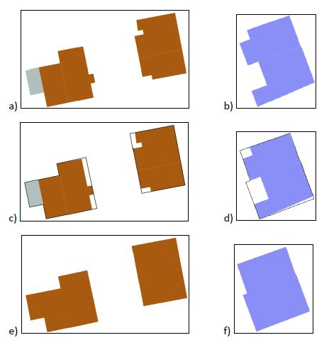
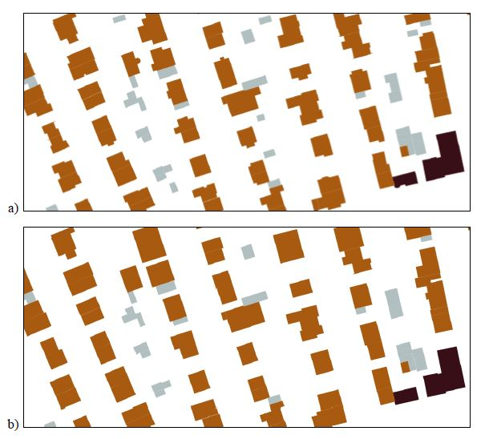
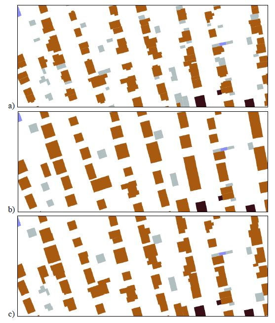

# Automatic buildings generalisation
An angoritm to perform semi-automatic generalisation of buildings geometry. The program is made for "EGiB" data. The output and input coordinate system is EPSG 2177. Sample data "buildings.shp" contains "EGiB" buildings data from Poznań 

### How to run?
Dependencies: 
* Shapely
* Fiona

You can install all dependencies with `requirements.txt`.

To run the program insert 4 arguments:
* -s (scale) - output scale (avilable scales are 10000 and 25000)
* -m (mode) - relevant only in 25k scale (modes: typifications and union)
* -f (file) - path to input Shapefile
* -o (output_dir) - path to output directory

```
'main.py -s 25000 -m union -f C:\Automatic_buildings_generalisation\sample_data\buildings.shp -o C:\Automatic_buildings_generalisation\sample_data\result25k'
```
### Output files

#### Scale 10k:
* 'eliminated.shp' - buildings that should be eliminated because of their insufficient size 
* 'generalised_to_rectangle.shp' - buildings generalised to rectangle
* 'notGeneralised'- buildings with complicated shape that should be generalised manually

#### Scale 25k:
* 'eliminated.shp' - buildings that should be eliminated because of their insufficient size
* 'generalised_to_rectangle.shp' - buildings generalised to rectangle
* 'notGeneralised.shp'- buildings with complicated shape that should be generalised manually
* 'generalised_to_signature.shp'- buildings which geometry was changed to Point and contain 'Rotation' property for signature rotation.
  ##### Mode union:
* 'union.shp' - groups of buildings with the same type unioned into one shape. If its possible, shapes of buildings are firstly generalised to rectangle. 
  ##### Mode typification:
* 'typificated.shp' - groups of buildings with the same type that are typificated

### Results
#### Generalised to rectangle sample:


a) Raw buildings shape
b) Generalised to rectangle

#### Typification sample:


a), b) Raw buildings shape
c), d) Raw + typificated
e), f) Typificated

#### Union sample:


a), b) Raw buildings shape
c), d) Raw + unioned
e), f) Unioned

#### 10k generalisation sample:


a) Raw buildings shape
b) Generalised to 10k

#### 25k generalisation sample:


a) Raw buildings shape
b) Generalised with typification mode
c) Generalised with union mode